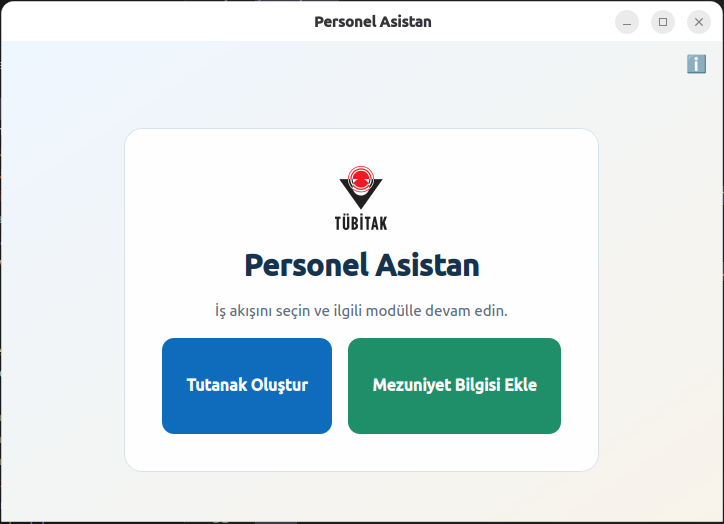
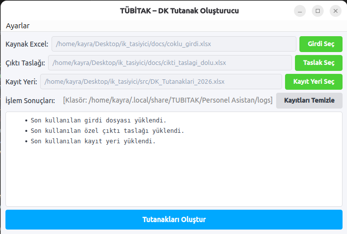
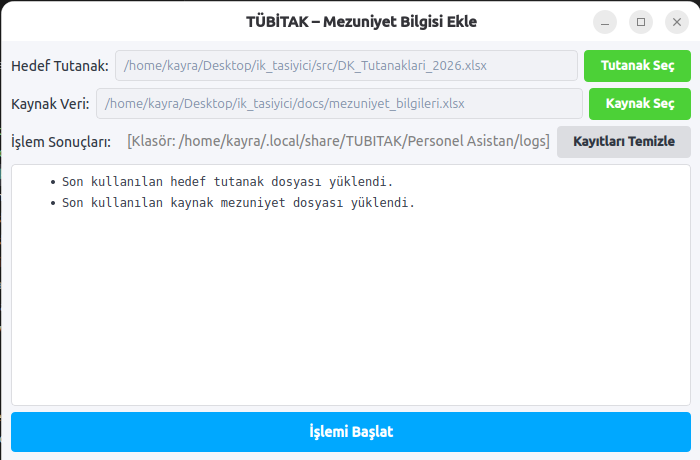
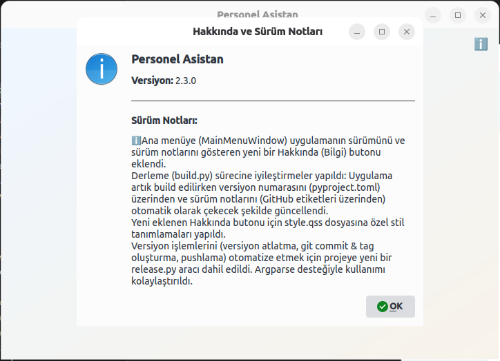

  
  
  <h1>📋 Personel Asistan</h1>
  
<strong>İnsan Kaynakları Personelleri için Pratik Derece-Kademe Karar Tutanağı Oluşturucu</strong>

---

## 🎯 Hakkında

**Personel Asistan**, 2026 yılı ve sonrasında işe başlayan personelleriniz için **Derece-Kademe (D-K) Karar Tutanaklarını** saniyeler içinde ve hatasız bir şekilde hazırlamanızı sağlayan pratik bir İnsan Kaynakları (İK) asistanıdır. 

Manuel veri girişleriyle ve hesaplama sayfalarıyla uğraşmanıza gerek kalmaz. Sadece çalışan bilgilerini elle menülere girin; program seviye-kıdem tablolarını kullanarak hesaplamaları arkaplanda otomatik yapar ve kurumunuza uygun Excel formatında karar tutanağını hazırlar.

---

## 🚀 Kurulum & Çalıştırma

Program bilgisayarınızda karmaşık bir kurulum gerektirmez. Hemen kullanmaya başlamak için:

1. [Releases (Sürümler) sayfasına gidin](../../releases/latest).
2. En son sürüm olan `.exe` (örneğin `DK_Tutanak_Olusturucu_v2.3.0.exe`) dosyasını bilgisayarınıza indirin.
3. İndirdiğiniz dosyaya **çift tıklayarak** programı anında çalıştırın.

> 💡 **Not:** Bilgisayarınızda Microsoft Excel yüklü olması yeterlidir. Herhangi bir ekstra yazılım kurmanıza **gerek yoktur**.

---

## 💡 Nasıl Kullanılır?

Programı açtığınızda şık ve basit bir menü ile karşılaşacaksınız:

  

### 1️⃣ Tutanak Oluştur
Bu modül sayesinde yeni işe başlayan personelin bilgilerini girerek otomatik karar tutanağı oluşturabilirsiniz.

- Personelin mezuniyet seviyesini, unvanını ve diğer temel işe giriş parametrelerini sağlanan forma girin.
- Sonuçlar sizin yerinize "Hesapla" butonuna bastığınız anda hesaplanır.
- Kaydedilen tutanak Excel formatında şablon halinde bilgisayarınıza kaydedilir.

  

### 2️⃣ Mezuniyet Bilgisi Ekle
Çalışanların eğitim bilgilerini manuel olarak kolay bir şekilde programa işleyebilirsiniz.

- Bu ekranda çalışanın eğitim düzeylerini (Lisans, Yüksek Lisans, Doktora vb.) manuel olarak belirtebilirsiniz.

  

---

## ℹ️ Sürüm Bilgisi ve Yenilikler

Ana menünün sağ üst köşesinde yer alan **Hakkında (ℹ️)** butonuna tıklayarak uygulamanın mevcut sürümünü *(Örn: v2.3.0)* görüntüleyebilir ve bugüne kadar programda yapılan yenilikleri (Sürüm Notları) tek ekranda okuyabilirsiniz.

  

---

## 📌 İpuçları ve Örnek Dosyalar

Veri girişlerini uygulamanın kullanıcı dostu arayüzünü kullanarak hiçbir teknik bilgi gerekmeden kolayca yapabilirsiniz. İşlemlerin arka planını incelemek veya tutanak çıktı örneklerine göz atmak isterseniz `docs/` klasörü içerisinde aşağıdaki örnek dosyalarımızdan faydalanabilirsiniz:

- 📄 `DK_Tutanaklari_2026.xlsx`
- 📄 `cikti_ornegi.xlsx`
- 📄 `cikti_taslagi_dolu.xlsx`
- 📄 `mezuniyet_bilgileri.xlsx`

---
*Bu yazılım hızlı ve hatasız tutanak oluşturmak isteyen İK profesyonellerinin iş akışını güçlendirmek için tasarlanmıştır.*
